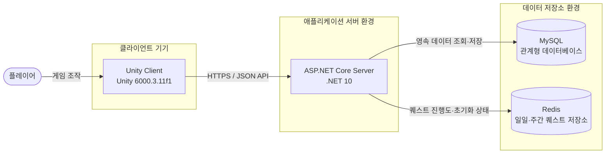

# Deployment

## 목적

이 문서는 니케 모작 서비스의 목표 배포 구성을 정의하며, 현재 구현 완료 상태가 아니라 개발과 배포가 지향하는 기술 구조를 나타낸다.

## Deployment 다이어그램

## 구성요소

| 구분 | 목표 기술 | 역할 |
|---|---|---|
| Client | Unity 6000.3.11f1 | 플레이어 입력, 화면 표시, 전투 연출 및 서버 API 호출을 담당한다. |
| Server | ASP.NET Core / .NET 10 | 인증과 게임 유즈케이스를 처리하고 게임 규칙 및 데이터 접근을 조정한다. |
| RDBMS | MySQL | 계정, 프로필, 보유 니케, 친구 관계, 인벤토리 및 확정된 전투 결과처럼 영속성이 필요한 데이터를 저장한다. |
| Quest data store | Redis | 일일·주간 퀘스트의 진행도, 완료 여부 및 초기화 시각처럼 주기적으로 갱신되는 상태를 저장한다. |

## 구성요소별 설명

### Unity Client

Unity Client는 플레이어 기기에 설치되는 게임 실행 프로그램으로, UI와 전투 화면을 제공하고 서버와 HTTPS 기반 JSON API로 통신한다. 서버 데이터가 필요한 기능은 공통 네트워크 계층을 통해 호출하며 UI 또는 게임 로직에서 직접 데이터베이스에 접근하지 않는다.

### ASP.NET Core Server

ASP.NET Core Server는 클라이언트 요청을 인증하고 계정, 소셜, 니케 관리, 모집, 스쿼드, 전투 및 인벤토리 유즈케이스를 처리한다. 서버는 게임 규칙의 최종 검증 주체이며 MySQL과 Redis 접근을 조정한다.

### MySQL

MySQL은 서비스 재시작이나 장애 이후에도 보존되어야 하는 영속 데이터를 저장하는 관계형 데이터베이스이다. 데이터 정합성이 중요한 재화 차감, 보상 지급, 모집 결과 및 성장 반영은 트랜잭션을 사용하여 부분 변경이 남지 않게 처리한다.

### Redis

Redis는 메모리를 중심으로 데이터를 처리하는 고속 키-값 저장소이며, 본 시스템에서는 `일일·주간 퀘스트 저장소`로 사용한다. 주기적으로 초기화되는 퀘스트 상태를 빠르게 조회하고 갱신하는 역할을 담당한다.

저장 대상은 다음과 같다.

- 플레이어별 일일 퀘스트 진행도와 완료 여부
- 플레이어별 주간 퀘스트 진행도와 완료 여부
- 퀘스트 보상 수령 여부
- 다음 일일·주간 초기화 시각
- 퀘스트 상태의 만료 시간

일일 퀘스트 데이터에는 다음 일일 초기화 시각을 기준으로 만료 시간을 적용하고, 주간 퀘스트 데이터에는 다음 주간 초기화 시각을 기준으로 만료 시간을 적용한다. 퀘스트 보상으로 지급된 재화와 아이템 및 보상 지급 기록은 영구 데이터이므로 MySQL에 저장한다.

## 통신 및 데이터 흐름

1. 플레이어가 Unity Client에서 기능을 실행한다.
2. Unity Client가 HTTPS를 통해 ASP.NET Core Server에 요청을 전송한다.
3. Server가 인증 정보와 요청 형식을 확인한다.
4. Server가 퀘스트 관련 요청이면 Redis에서 일일·주간 퀘스트 상태를 조회하거나 갱신한다.
5. Server가 계정 데이터 조회 또는 퀘스트 보상 지급이 필요하면 MySQL을 트랜잭션으로 변경한다.
6. Server가 처리 결과를 JSON 응답으로 반환한다.
7. Unity Client가 결과를 게임 화면과 로컬 상태에 반영한다.

## 배포 원칙

- Client는 Server API만 호출하며 MySQL과 Redis에 직접 연결하지 않는다.
- MySQL과 Redis는 외부에 공개하지 않고 Server에서만 접근할 수 있게 구성한다.
- Client와 Server 사이의 운영 통신은 HTTPS를 사용한다.
- 비밀번호, 연결 문자열 및 인증 키는 소스 코드가 아닌 환경별 비밀 설정으로 관리한다.
- MySQL은 정기적으로 백업하고 복구 절차를 검증한다.
- Redis에는 주기적으로 초기화되는 퀘스트 상태를 저장하고 데이터별 만료 시간을 설정한다.
- 퀘스트 보상 지급 결과와 계정 자산은 MySQL에 영구적으로 기록한다.
- 개발, 테스트 및 운영 환경은 연결 정보와 데이터 저장소를 분리한다.

## 향후 확장 고려사항

초기에는 Client, Server, MySQL 및 Redis로 단순하게 구성하고, 사용량 증가에 따라 Server 다중 인스턴스, 로드 밸런서, Redis 고가용성 및 MySQL 복제 구성을 검토한다.
